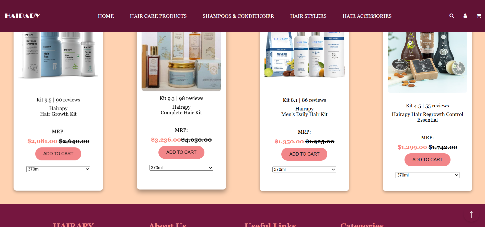
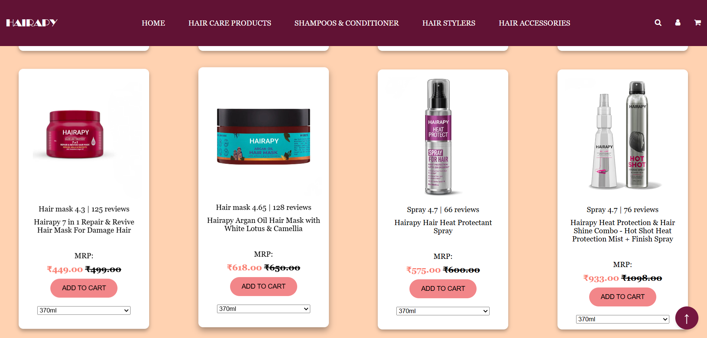
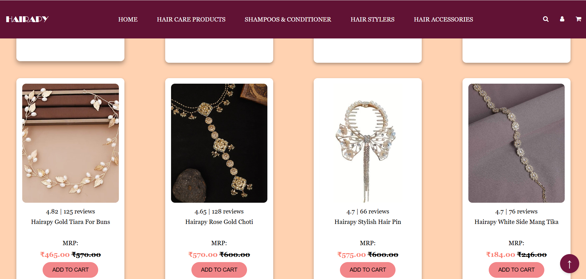
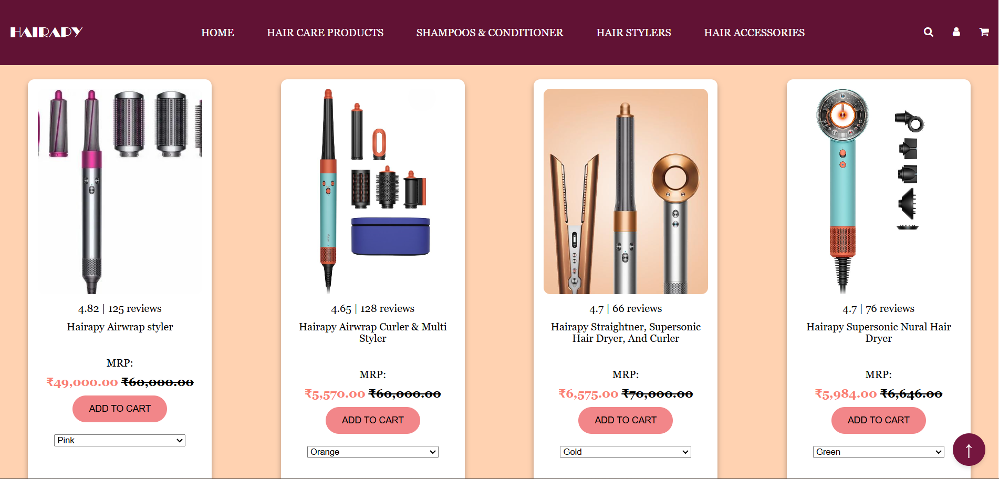
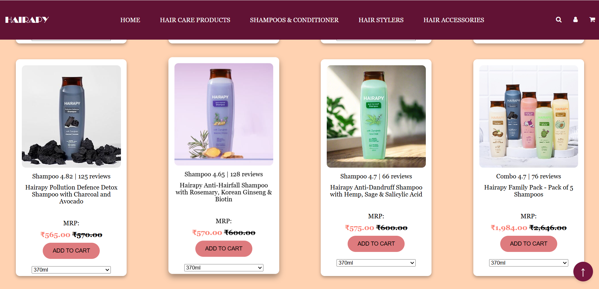
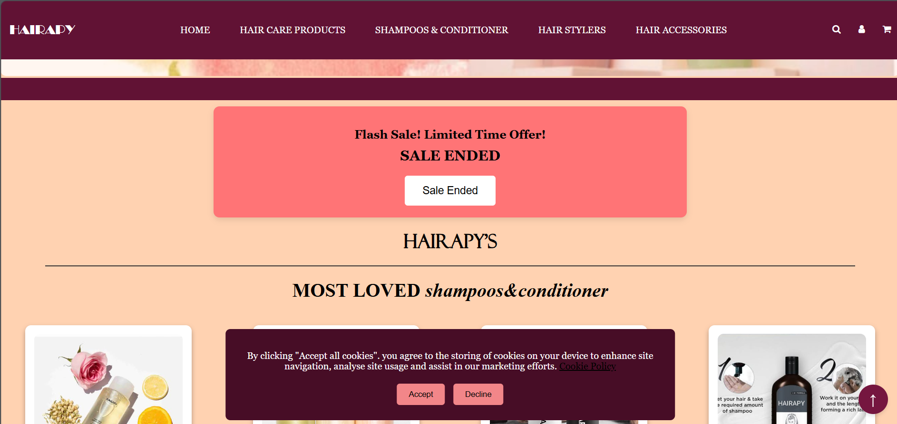

# Hairapy – E-commerce Website

##  About The Project
Hairapy is a responsive e-commerce website for hair care products.  
Users can browse products, explore categories, and add items to cart.  
This project was created to practice frontend web development concepts.

##  Features
- Product listing
- Add to cart functionality
- Flash sale banner
- Category navigation
- Responsive design
- Cookie consent popup

##  Technologies Used
- HTML5
- CSS3
- JavaScript

## Screenshots

###  Homepage

###  Hair Care Products

###  Hair Accessories

###  Hairstyler Section

###  Shampoo & Conditioner

###  Sale Banner & Cookie Popup

##  Live Demo
https://yashfink7-creator.github.io/hairapy1/

##  Learning Outcomes
- DOM manipulation using JavaScript
- Responsive website design
- UI layout structuring

##  Author
Developed by Yashfin Khan
